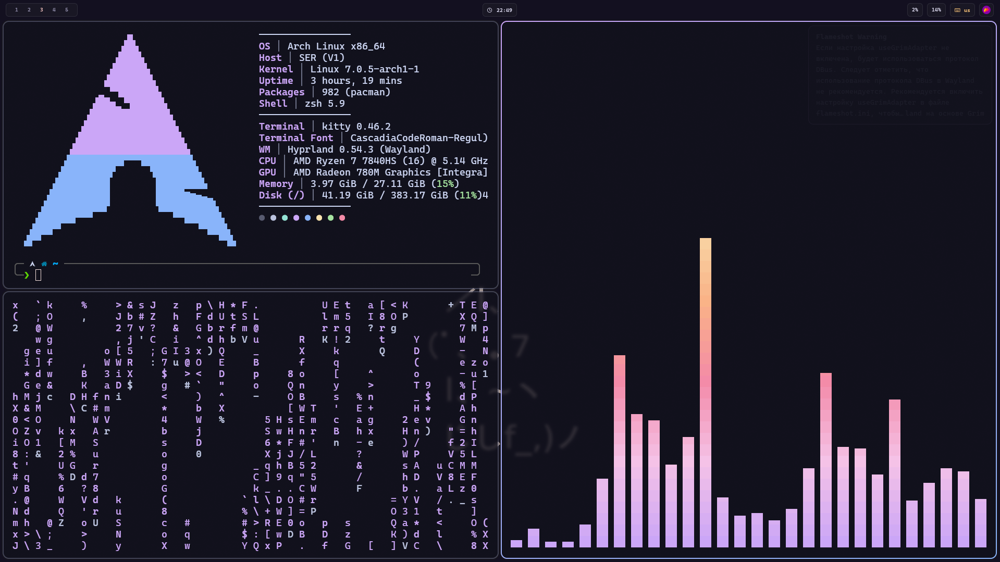

# dotfiles / config backup



Полный бэкап конфигов Arch Linux с Hyprland.

## Состав

| Категория | Что внутри |
|-----------|-----------|
| **wm/** | Hyprland, Waybar, Wofi, Dunst, Swaylock, Gtklock |
| **gtk-qt/** | GTK3/4, Qt5ct, Qt6ct, Kvantum, nwg-look, xsettingsd |
| **kde/** | Dolphin, KDE globals, QtProject.conf, color-schemes |
| **terminal/** | Kitty, Btop, Cava |
| **editors/** | Neovim, Zed |
| **apps/** | Fastfetch, Flameshot, MPV, LACT, dconf, autostart, session, MIME, user-dirs |
| **dotfiles/** | .bashrc, .zshrc, .gtkrc-2.0, .p10k.zsh |
| **icons/** | Иконки |
| **wallpapers/** | Обои |

## Использование на новой системе

```bash
cd ~/builder
./install-configs.sh        # установка пакетов + конфиги
./install-configs.sh --no-pkgs  # только конфиги
```
